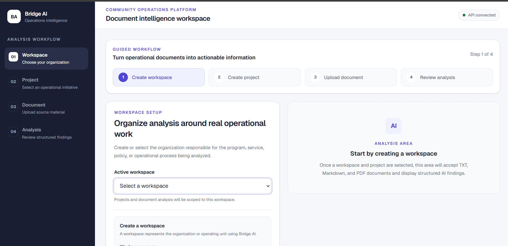
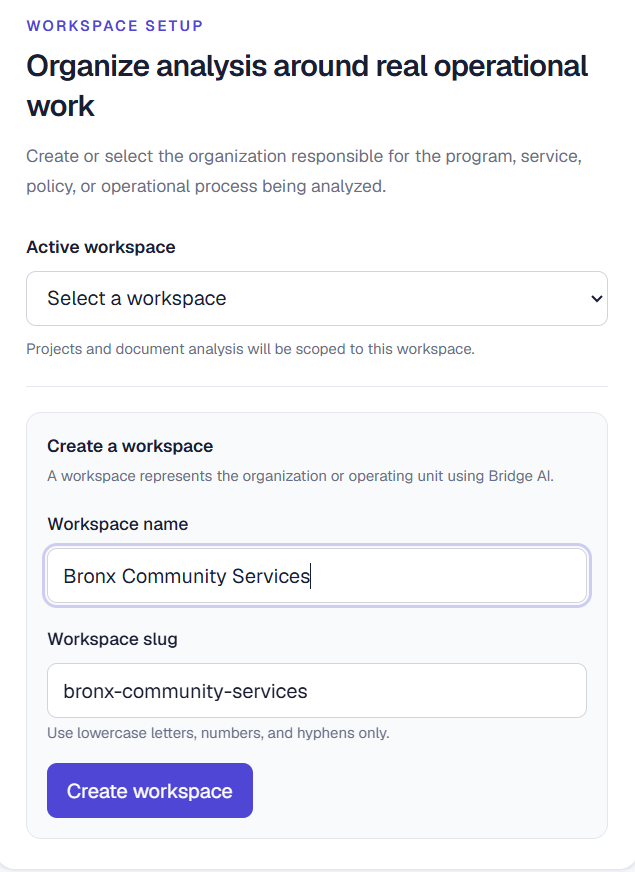
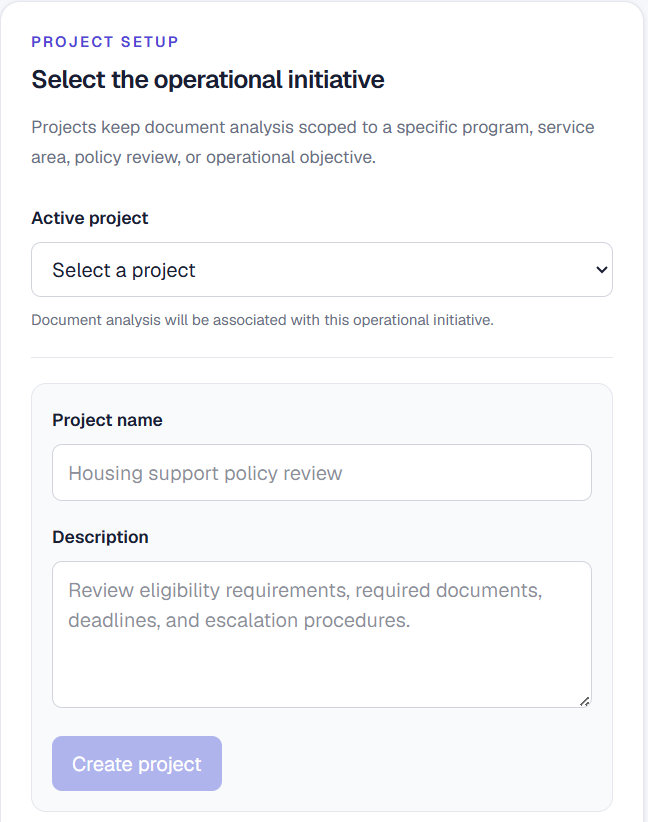
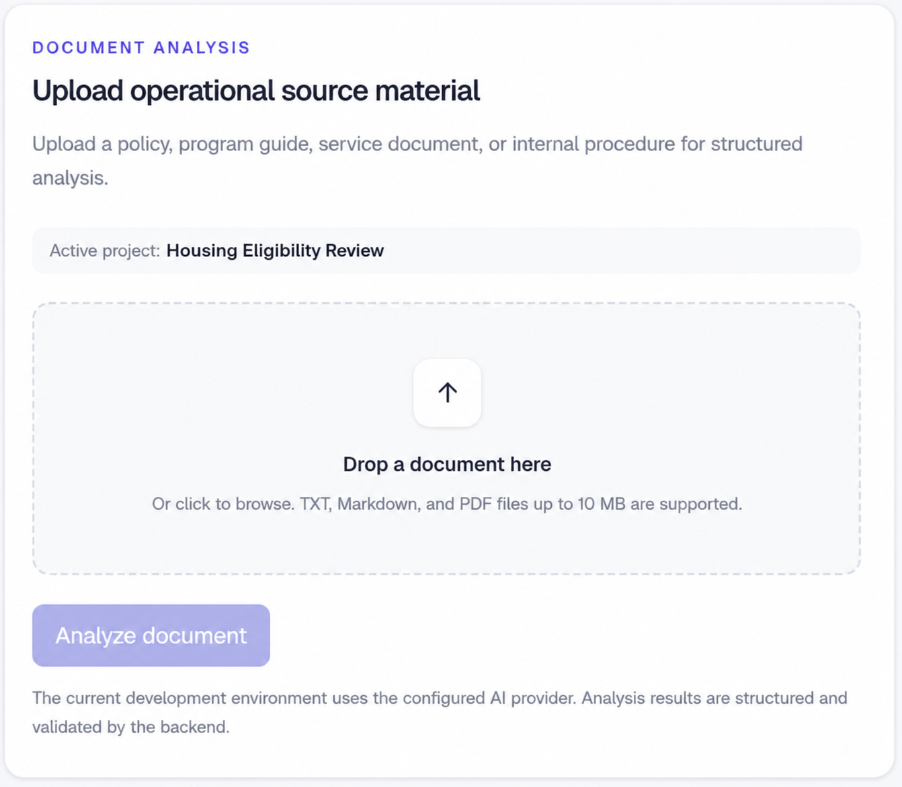
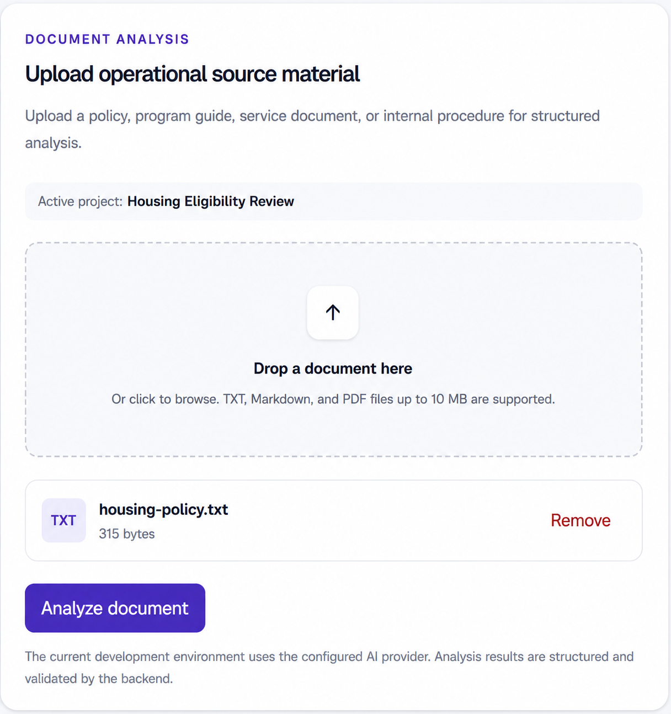
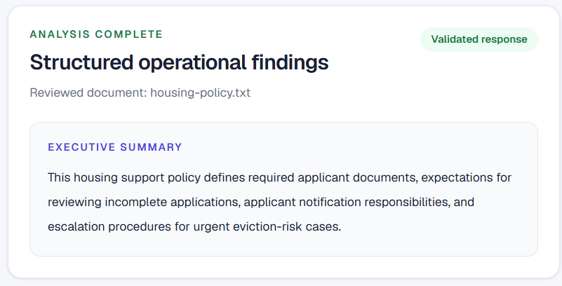
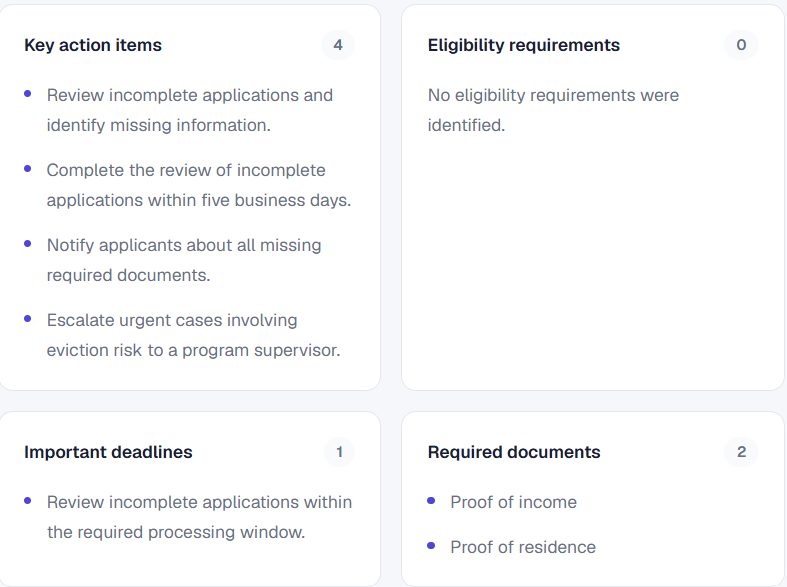
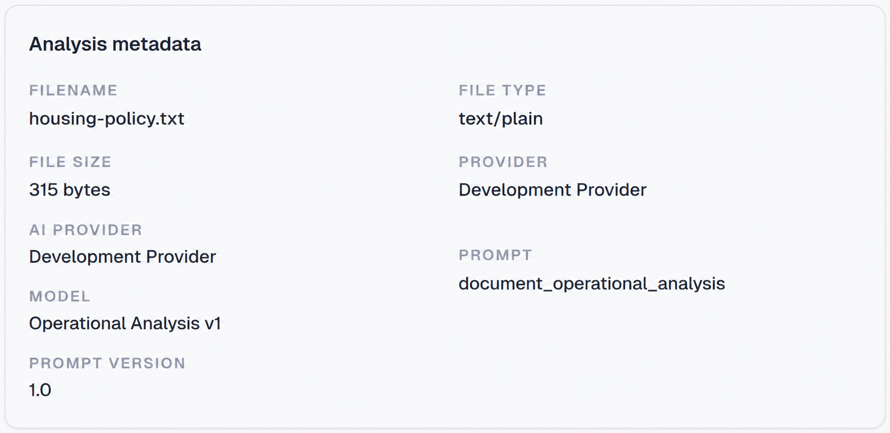
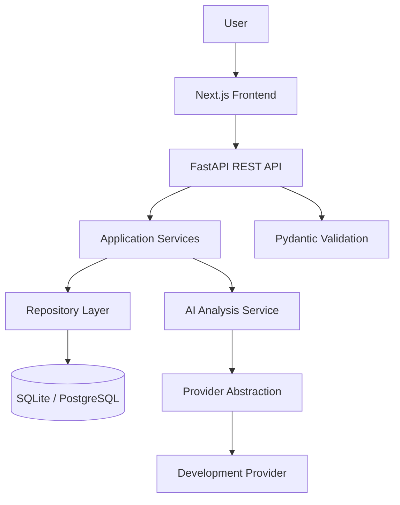
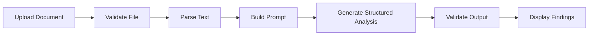

# Bridge AI

<p align="center">
  <strong>AI-powered operational intelligence for community organizations</strong>
</p>

<p align="center">
  Transform operational documents into structured findings, eligibility requirements, required documentation, risks, deadlines, and recommended next steps.
</p>

<p align="center">
  <a href="https://bridge-ai-virid.vercel.app">Live Application</a>
  ·
  <a href="https://bridge-ai-9hfd.onrender.com/docs">API Documentation</a>
  ·
  <a href="https://github.com/Mustak-Eman/bridge-ai">GitHub Repository</a>
</p>

---



## Overview

Bridge AI is a production-style full-stack AI operations platform designed for nonprofits, housing agencies, workforce development organizations, educational institutions, food assistance programs, and local governments.

Community organizations often rely on lengthy policy manuals, government guidance, program requirements, and internal procedures. Staff must manually review these documents to identify eligibility rules, required evidence, deadlines, risks, and appropriate follow-up actions.

Bridge AI streamlines that process by converting operational source material into consistent, structured findings.

Unlike a general-purpose chatbot, Bridge AI focuses on a defined operational workflow:

1. Create an organizational workspace.
2. Create a project for a specific operational initiative.
3. Upload a supported document.
4. Validate and parse its contents.
5. Generate a structured document analysis.
6. Review actionable findings in the dashboard.

## Problem Addressed

Operational staff frequently need to answer questions such as:

- Who qualifies for a program?
- What documents must an applicant provide?
- Which deadlines require attention?
- What steps should staff complete next?
- What risks or missing information could delay a decision?
- Which findings still require human verification?

Bridge AI organizes this information into a repeatable format, helping reduce manual review time and improve consistency.

## Features

### Structured Document Analysis

Bridge AI supports operational source material such as:

- Policy manuals
- Program guides
- Housing policies
- Eligibility requirements
- Service documentation
- Internal procedures
- Plain-text and Markdown documents
- Text-based PDF documents

Generated analysis may include:

- Executive summary
- Action items
- Required documents
- Eligibility requirements
- Important deadlines
- Operational risks
- Recommended next steps
- Verification status
- Analysis metadata

### Workspace Management

Create independent workspaces for different organizations, agencies, programs, or departments.

### Project Management

Create projects within each workspace to organize analyses around specific initiatives, such as:

- Housing eligibility review
- Workforce development
- Public assistance
- Grant compliance
- Program enrollment
- Internal policy review

### Document Validation

Uploaded documents are checked for:

- Supported file type
- Supported media type
- Maximum file size
- Empty content
- Parseable text

### Provider Abstraction

The AI layer uses a provider interface instead of coupling the application to one vendor.

The current public deployment uses a deterministic development provider, allowing the complete analysis workflow to run without paid external API usage. The architecture is designed so another provider can be introduced without rewriting the application or API layers.

### Production-Style Dashboard

The frontend includes:

- Workspace selection
- Project selection
- Workspace and project creation
- Drag-and-drop document upload
- Structured result cards
- Analysis metadata
- Responsive layout
- API error handling
- Loading and empty states

## Application Walkthrough

### 1. Dashboard

The dashboard provides access to the workspace, project, and document-analysis workflow.


### 2. Create a Workspace

Workspaces represent organizations, departments, or operational teams.



### 3. Create a Project

Projects organize document analyses around a specific operational initiative.



### 4. Upload Operational Source Material

Users can upload supported policy, program, service, and procedural documents.



### 5. Review the Selected Document

The interface displays the selected file before analysis begins.



### 6. Review the Analysis Summary

Bridge AI presents a structured executive summary and operational assessment.



### 7. Review Operational Findings

The analysis separates important information into actionable categories.



### 8. Inspect Analysis Metadata

Metadata records the uploaded file, analysis configuration, prompt, model, and prompt version.



## Architecture

Bridge AI follows a layered architecture intended to keep business logic, data access, API handling, and AI integration separate.



### Architectural Principles

- Layered architecture
- Repository pattern
- Application service layer
- Dependency injection
- Provider abstraction
- Structured AI outputs
- Pydantic request and response validation
- Modular REST API design
- Environment-based configuration
- Database migrations
- Automated testing

## Document Analysis Workflow



The backend performs the following steps:

1. Confirms that a workspace and project exist.
2. Validates the uploaded file.
3. Extracts text using the appropriate parser.
4. Builds a versioned operational-analysis prompt.
5. Sends the content through the configured provider.
6. Validates the structured response with Pydantic.
7. Returns the findings and metadata through the REST API.

## Technology Stack

### Backend

- Python
- FastAPI
- SQLAlchemy 2
- Alembic
- Pydantic v2
- Pydantic Settings
- SQLite
- PostgreSQL-ready database configuration
- Pytest
- Uvicorn

### Frontend

- Next.js 16
- React
- TypeScript
- Tailwind CSS
- Fetch-based REST API integration

### AI and Document Processing

- AI provider abstraction
- Structured output models
- Versioned prompt templates
- Plain-text parser
- Markdown parser
- PDF text extraction
- File validation
- Deterministic development provider

### Deployment

- Vercel for the frontend
- Render for the backend
- GitHub for source control and release management

## Project Structure

```text
bridge-ai/
├── backend/
│   ├── alembic/
│   ├── app/
│   │   ├── ai/
│   │   ├── api/
│   │   ├── core/
│   │   ├── db/
│   │   ├── domain/
│   │   ├── models/
│   │   ├── repositories/
│   │   ├── schemas/
│   │   └── services/
│   ├── tests/
│   ├── alembic.ini
│   └── requirements.txt
│
├── frontend/
│   ├── public/
│   ├── src/
│   │   ├── app/
│   │   ├── components/
│   │   ├── lib/
│   │   └── types/
│   └── package.json
│
├── docs/
│   └── images/
│       ├── analysis-metadata.png
│       ├── analysis-summary.png
│       ├── dashboard.png
│       ├── document-selected.png
│       ├── document-upload.png
│       ├── operational-findings.png
│       ├── project-creation.png
│       └── workspace-creation.png
│
├── LICENSE
└── README.md
```

## Live Deployment

### Frontend

[Open Bridge AI](https://bridge-ai-virid.vercel.app)

### Backend API Documentation

[Open Swagger UI](https://bridge-ai-9hfd.onrender.com/docs)

The backend is hosted on Render's free service tier. The first request after a period of inactivity may take additional time while the service starts.

## Local Installation

### Prerequisites

Install:

- Git
- Python 3.13 or a compatible Python version
- Node.js
- npm

### 1. Clone the Repository

```bash
git clone https://github.com/Mustak-Eman/bridge-ai.git
cd bridge-ai
```

## Backend Setup

### 1. Enter the Backend Directory

```bash
cd backend
```

### 2. Create a Virtual Environment

```bash
python -m venv .venv
```

### 3. Activate the Environment

Windows PowerShell:

```powershell
.venv\Scripts\Activate.ps1
```

Windows Command Prompt:

```cmd
.venv\Scripts\activate
```

macOS or Linux:

```bash
source .venv/bin/activate
```

### 4. Install Dependencies

```bash
pip install -r requirements.txt
```

### 5. Configure Environment Variables

Create `backend/.env` using `backend/.env.example` as a reference.

Minimal local configuration:

```env
APP_NAME=Bridge AI
ENVIRONMENT=development
DEBUG=true

DATABASE_URL=sqlite:///./bridge_ai.db

AI_PROVIDER=fake
AI_MODEL=fake-document-analyzer-v1

ALLOWED_ORIGINS=["http://localhost:3000"]
```

Do not commit real credentials or API keys.

### 6. Apply Database Migrations

```bash
alembic upgrade head
```

### 7. Start the Backend

```bash
uvicorn app.main:app --reload
```

The backend will be available at:

```text
http://127.0.0.1:8000
```

Interactive API documentation:

```text
http://127.0.0.1:8000/docs
```

## Frontend Setup

Open another terminal from the repository root.

### 1. Enter the Frontend Directory

```bash
cd frontend
```

### 2. Install Dependencies

```bash
npm install
```

### 3. Configure the API URL

Create `frontend/.env.local`:

```env
NEXT_PUBLIC_API_BASE_URL=http://127.0.0.1:8000/api/v1
```

### 4. Start the Frontend

```bash
npm run dev
```

The frontend will be available at:

```text
http://localhost:3000
```

## API Overview

Base path:

```text
/api/v1
```

### System

| Method | Endpoint | Purpose |
|---|---|---|
| `GET` | `/health` | Confirm API health |

### Workspaces

| Method | Endpoint | Purpose |
|---|---|---|
| `POST` | `/workspaces` | Create a workspace |
| `GET` | `/workspaces` | List workspaces |
| `GET` | `/workspaces/{workspace_id}` | Retrieve a workspace |
| `PATCH` | `/workspaces/{workspace_id}` | Update a workspace |
| `DELETE` | `/workspaces/{workspace_id}` | Delete a workspace |

### Projects

| Method | Endpoint | Purpose |
|---|---|---|
| `POST` | `/workspaces/{workspace_id}/projects` | Create a project |
| `GET` | `/workspaces/{workspace_id}/projects` | List projects in a workspace |
| `GET` | `/projects/{project_id}` | Retrieve a project |
| `PATCH` | `/projects/{project_id}` | Update a project |
| `DELETE` | `/projects/{project_id}` | Delete a project |

### Document Analysis

The document-analysis endpoint accepts an uploaded operational document associated with a project and returns validated structured findings.

The exact request and response schemas are available through the interactive API documentation:

[View API Documentation](https://bridge-ai-9hfd.onrender.com/docs)

## Example Analysis

A housing policy may produce findings similar to:

### Executive Summary

> Housing applicants must provide proof of residency and income before an eligibility decision can be completed.

### Action Items

- Collect proof of residency.
- Verify household income.
- Review required identification.
- Schedule an eligibility review.
- Notify the applicant of missing information.

### Required Documents

- Government-issued identification
- Proof of address
- Income verification
- Supporting household documentation

### Operational Risk

Incomplete documentation may delay eligibility review or prevent staff from completing an eligibility determination.

### Recommended Next Step

Review the submitted evidence, identify missing documents, and schedule applicant verification.

## Testing

### Backend Tests

From the `backend` directory:

```bash
pytest
```

Current backend status:

```text
114 tests passing
```

The backend suite covers areas including:

- Configuration
- Exception handling
- Database behavior
- Domain models
- Repository operations
- Application services
- Workspace APIs
- Project APIs
- Document validation
- Document parsing
- AI models
- AI providers
- Document-analysis services
- Document-analysis endpoints

### Frontend Validation

From the `frontend` directory:

```bash
npm run lint
npm run build
```

Current frontend status:

- ESLint passing
- TypeScript validation passing
- Production build passing

## Design Decisions

### Why Bridge AI Is Not a General Chatbot

Operational work requires repeatable outputs. Free-form chat responses can vary in structure and may omit important categories.

Bridge AI instead returns a defined schema so the frontend and operational staff can consistently locate summaries, documents, risks, deadlines, and recommended actions.

### Why Use a Provider Abstraction?

Directly coupling the application to one AI vendor would make testing and future migration more difficult.

The provider abstraction allows the analysis service to depend on a stable internal interface while individual providers handle vendor-specific behavior.

### Why Use a Repository and Service Layer?

The repository layer isolates database operations, while the service layer contains application rules. This keeps API route handlers small and makes the core behavior easier to test independently.

### Why Use a Development Provider?

The deterministic development provider enables:

- Free local and public demonstrations
- Reliable automated tests
- Repeatable structured results
- Development without exposing API credentials
- Future integration with external providers

## Current Limitations

- The public deployment uses a development provider rather than a production large-language-model API.
- SQLite storage on the free backend deployment is not intended for durable production data.
- PDF support depends on extractable text and does not currently include OCR.
- Authentication and role-based authorization are not yet implemented.
- Human review remains necessary before using findings for real eligibility or policy decisions.

## Roadmap

Potential future improvements include:

- Anthropic provider integration
- Additional provider implementations
- PostgreSQL production persistence
- User authentication
- Role-based access control
- OCR for scanned documents
- Enhanced PDF parsing
- Searchable document knowledge base
- Saved analysis history
- Bulk document processing
- PDF report export
- Audit logging
- Additional operational-analysis templates

## Responsible Use

Bridge AI is intended to support document review, not replace professional judgment.

Analyses should be verified by qualified staff before being used for eligibility decisions, legal interpretation, benefit determinations, housing decisions, or other high-impact actions.

Do not upload confidential or personally identifiable information to public demonstration deployments.

## License

This project is licensed under the [MIT License](LICENSE).

## Author

**Mustak Eman**  
Computer Science Student, Lehman College (CUNY)

- [GitHub](https://github.com/Mustak-Eman)
- [LinkedIn](https://www.linkedin.com/in/mustak-eman-6517b2198)
